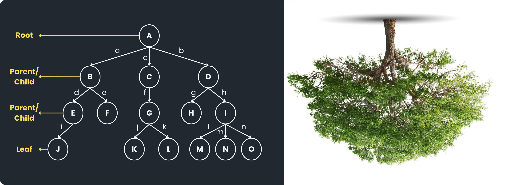
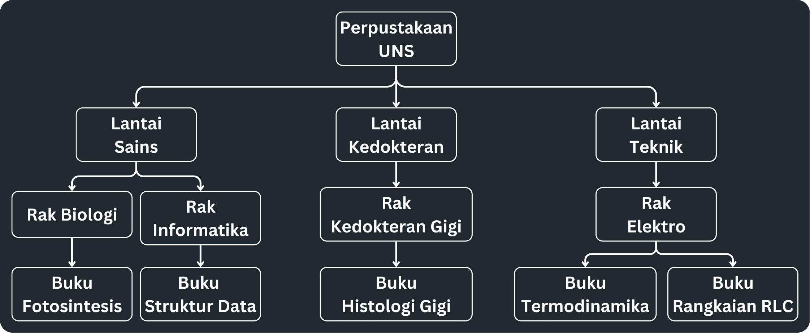
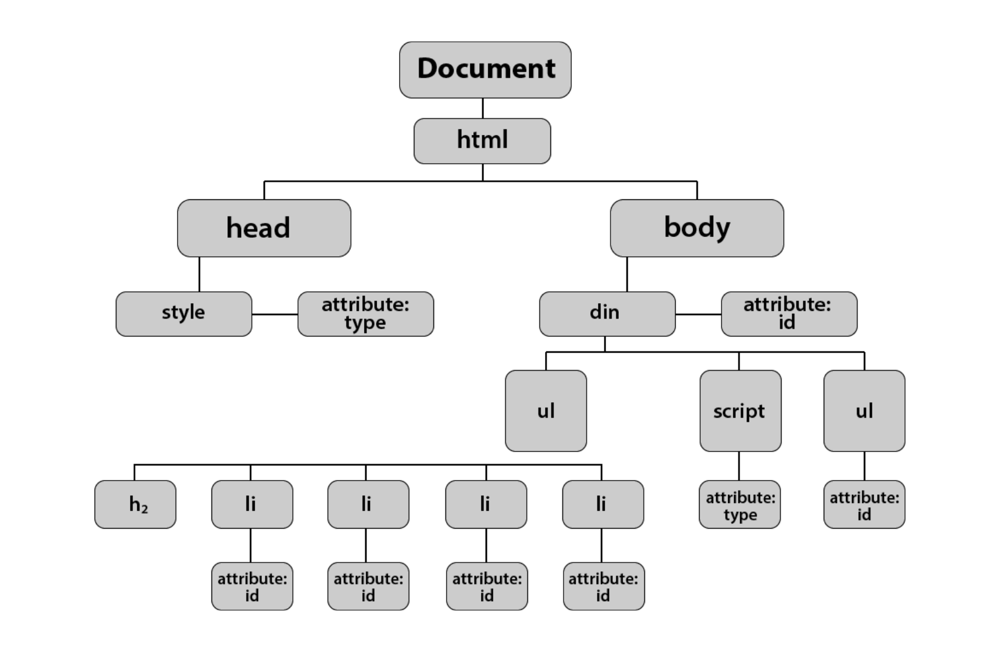

# 5 - Tree

- [5 - Tree](#5---tree)
  - [Definition](#definition)
    - [Terminologi](#terminologi)
    - [Perbedaan dengan Struktur Data yang Lain](#perbedaan-dengan-struktur-data-yang-lain)
  - [Kenapa menggunakan Tree?](#kenapa-menggunakan-tree)
  - [Contoh Kasus](#contoh-kasus)
    - [1. Sistem Perpustakaan UNS](#1-sistem-perpustakaan-uns)
    - [2. File Explorer](#2-file-explorer)
    - [3. DOM HTML](#3-dom-html)
  - [Implementasi](#implementasi)
    - [1. Meng-*import* Library ArrayList](#1-meng-import-library-arraylist)
    - [2. Membuat Class Node](#2-membuat-class-node)
    - [3. Membuat Constructor Node pada Class Node](#3-membuat-constructor-node-pada-class-node)
    - [4. Membuat Method "insert()"](#4-membuat-method-insert)
    - [5. Membuat Method "remove()"](#5-membuat-method-remove)
    - [6. Membuat Method "\_traversal()"](#6-membuat-method-_traversal)
    - [7. Membuat Method "traversal()"](#7-membuat-method-traversal)
  - [Contoh](#contoh)
  - [Tambahan](#tambahan)
    - [Traversal Post-Order](#traversal-post-order)


## Definition
Tree merupakan konsep Struktur Data non-linear di mana data-data di dalamnya saling berhubungan (*linked*) dan disusun secara hierarki (bertingkat). Tree biasanya digunakan untuk menyimpan data yang memiliki hubungan secara hierarki antara satu dengan yang lainnya. Tree mengambil konsep dari sebuah pohon yang terbalik dengan ilustrasi sebagai berikut:


<hr>

### Terminologi
Tree tersusun atas *node-node* yang dapat dikategorikan sebagai *root node*, *parent node*, *child node*, dan *leaf*. Adapun penjelasan dari beberapa terminologi-terminologi lain pada tree yaitu:
- **Node**, merupakan data yang dihubungkan. Pada ilustrasi di atas, contoh *node* yaitu A, B, C, D, ... dan O
- **Edge**, merupakan hubungan di antara *node*. Pada ilustrasi di atas, contoh *edge* yaitu a, b, c, d, ... dan n
- **Root Node**, merupakan *node* pertama atau *node* paling atas dari sebuah *tree*. Pada ilustrasi di atas, *root node* merupakan *node* A
- **Parent Node**, adalah semua *node* yang memiliki *child node*. Pada ilustrasi di atas, *parent node* yaitu *node* A, B, C, D, E, F, G, H, dan I
- **Child Node**, adalah semua *node* yang dimiliki oleh *parent node*. Pada konsep *tree*, *child node* tidak dibatasi jumlahnya. Contoh *child node* pada ilustrasi di atas yaitu *node* B, C, D, E, F, G, H, I, K, L, M, N, dan O
- **Leaf Node**, adalah semua *node* yang tidak memiliki *child node* (berada di paling bawah). Pada ilustrasi di atas *leaf node* yaitu *node* J, K, L, M, N, dan O
- **Sub Tree**, adalah sebagian *tree* yang lebih kecil yang berada di dalam *tree* yang lebih besar. Contoh *sub tree* pada ilustrasi di atas yaitu *tree* dari *node* B, E, F, dan J.
- **Size Tree**, adalah jumlah semua *node* di dalam *tree*. Pada ilustrasi di atas, *size tree*-nya yaitu 15
- **Height of Tree**, adalah ketinggian *tree* dihitung dari *leaf node* hingga *root node*. *Height of Tree* juga dapat diketahui dengan menghitung panjang *edge* dari *leaf node* hingga *root node*. Pada ilustrasi di atas, *height of tree*-nya yaitu 3
- **Depth of Tree**, adalah kedalaman *tree* dihitung dari *root node* hingga *leaf node*. *Depth of Tree* juga dapat diketahui dengan menghitung panjang *edge* dari *root node* hingga *leaf node*. Pada ilustrasi di atas, *depth of tree*-nya yaitu 3

### Perbedaan dengan Struktur Data yang Lain
- Perbedaan *tree* dengan ***list*** yaitu *tree* disusun secara bertingkat-tingkat (hierarki) sedangkan *list* disusun secara lurus (linear)
- Perbedaan *tree* dengan ***graph*** yaitu struktur *tree* tidak membentuk *cycle* sedangkan *graph* membentuk *cycle*

## Kenapa menggunakan Tree?
- *Tree* mampu melakukan porses *insertion* dan *deletion* data dengan efisien karena menggunakan konsep *list*
- *Tree* digunakan untuk menyimpan dan mengorganisasi data secara **hierarkial** (bertingkat)
- *Tree* dapat digunakan untuk memudahkan dalam **proses *searching*** dengan cepat. Contoh Binary Search Tree dengan kompleksitas wakti O(log *n*)
- *Tree* dapat digunakan untuk memudahkan **proses *sorting***. Contoh proses pengaksesan *In-Order* pada Binary Search Tree
- Konsep *Tree* biasanya digunakan pada proses penyimpanan data yang besar (*big data*) seperti File Explorer, Database, DNS, dan HTML DOM (Documment Object Model)

## Contoh Kasus
### 1. Sistem Perpustakaan UNS


### 2. File Explorer
```
├── Applications
│   ├── Hades.app
│   │   └── Contents
│   │       ├── Info.plist
│   │       ├── MacOS
│   │       │   └── run.sh
│   │       └── Resources
│   │           └── shortcut.icns
│   ├── INSIDE.app
│   │   └── Contents
│   │       ├── Info.plist
│   │       ├── MacOS
│   │       │   └── run.sh
│   │       └── Resources
│   │           └── shortcut.icns
│   ├── Stardew Valley.app
│   │   └── Contents
│   │       ├── Info.plist
│   │       ├── MacOS
│   │       │   └── run.sh
│   │       └── Resources
│   │           └── shortcut.icns
...
```

### 3. DOM HTML


## Implementasi
> **Note**: Dalam bahasa Java, terdapat Library untuk struktur data *tree* yaitu *TreeModel*. Namun pada praktikum ini, **kita akan membuat *tree* kita sendiri dari awal**.

```java
root.insert(childNode_1);
root.remove_with_index(0);
root.traversal();
```

Terdapat tiga method utama dalam membuat *tree*. Ketiga *method* tersebut yaitu *insert*, *remove*, dan *traversal* (mengakses *node*). Dalam membuat *tree* dengan bahasa Java, kalian dapat mengikuti langkah-langkah berikut:

### 1. Meng-*import* Library ArrayList
```java
import java.util.ArrayList;
```
### 2. Membuat Class Node
```java
class Node{
    int data;   // tipe data bebas, berfungsi untuk menyimpan data
    ArrayList<Node> childrenNode = new ArrayList<>();    
}
```
>**Note:** Class Node digunakan untuk membuat *object* Node dengan atributdata dan childrenNode.

>**Note:** Menggunakan ArrayList dengan tipe data Node untuk menyimpan object-object *node* dari class Node di ArrayList *childrenNode* sebagai *child node*.

### 3. Membuat Constructor Node pada Class Node
```java
class Node{
    int data;   // tipe data bebas, berfungsi untuk menyimpan data
    ArrayList<Node> childrenNode = new ArrayList<>();

    // cunstructor
    Node(int data) {
        this.data = data;
    }
}
```
>**Note:** Constructor berfungsi untuk memudahkan pembuatan *object* dari *class* Node.

### 4. Membuat Method "insert()"
```java
class Node{
    int data;   // tipe data bebas, berfungsi untuk menyimpan data
    ArrayList<Node> childrenNode = new ArrayList<>();

    // cunstructor
    Node(int data) {
        this.data = data;
    }

    // Method
    public void insert(Node new_node) {
        childrenNode.add(new_node);
    }
}
```
>**Note:** Method ini tidak mengembalikan nilai apa apa (void) karena method ini memodifikasi object dari class Node dengan menambahkan *child node* ke dalam object untuk membentuk *tree*. Method *insert()* mengambil parameter object *new_node* dari class Node.

### 5. Membuat Method "remove()"
```java
...
    // Method
    public void insert(Node new_node) {
        childrenNode.add(new_node);
    }
    public void remove_with_index(int index) {
        // memeriksa ketersediaan index yang dicari
        // jika index out of bound
        if (index < 0 || index >= childrenNode.size()) {
            System.out.println("Child node dengan index " + index + " tidak ditemukan di dalam range index 0 - " + childrenNode.size());
            return;
        }

        // jika index child node ditemukan
        childrenNode.remove(index);
        System.out.println("Child node dengan index " + index + " berhasil dihapus");
    }
...
```
>**Note:** Method ini akan menghapus *child node* dengan indeks tertentu dari *parent node*. Indeks ditentukan bredasarkan urutan *insertion* dari *child node* yang ditambahkan.

### 6. Membuat Method "_traversal()"
```java
...
    private void _traversal(Node node, int depth) {
        for (int i = 0; i < depth; i++) {   // memperhatikan kedalaman tree
            System.out.print("---");         // untuk memudahkan pembacaan tree
        }
        System.out.println("> " + node.data);
        
        for (Node child : node.childrenNode) {
            _traversal(child, depth+1);
        }
    }
...
```
>**Note:** Method *_traversal()* merupakan fungsi yang digunakan untuk mengakses *node-node* di dalam *tree*. Method ini memiliki *access modifier private* di mana hanya *class* Node yang dapat mengakses *method* ini.

>**Note:** Method *_traversal()* mengambil parameter *node* dan *depth* di mana *node* merupakan *node* yang akan dijelajahi.

>**Note:** Method *_traversal()* menggunakan konsep Depth First Search yang menelusuri sejauh mungkin kedalaman *tree* terlebih dahulu. Method ini juga menerapkan konsep traversal pre-order (urut dari *root node*).

>**Note:** Method *_traversal()* mengimplementasikan konsep rekursi, di mana *method* ini akan memanggil sendiri *method* tersebut. Rekursi *method* ini akan berhenti ketika semua *child node* di dalam *childrenNode* sudah dijelajahi.

### 7. Membuat Method "traversal()"
```java
public void traversal(){
        _traversal(this, 0);    // mengambil dari kedalaman 0
    }
```
>**Note:** Method *traversal()* merupakan *method* yang dibuat untuk memudahkan penggunaan *method _traversal*. Method ini tidak mengambil parameter dan akan menjelajahi *node* yang dipilih untuk mengakses semua *child node* di dalam *node* tersebut satu persatu.

## Contoh
```java
import java.util.ArrayList;

class Node{
    int data;   // tipe data bebas, berfungsi untuk menyimpan data
    ArrayList<Node> childrenNode = new ArrayList<>();

    // cunstructor
    Node(int data) {
        this.data = data;
    }

    // Method
    public void insert(Node new_node) {
        childrenNode.add(new_node);
    }
    public void remove_with_index(int index) {
        // memeriksa ketersediaan index yang dicari
        // jika index out of bound
        if (index < 0 || index >= childrenNode.size()) {
            System.out.println("Child node dengan index " + index + " dari parent node '" + this.data + "' tidak ditemukan di dalam range index 0 - " + childrenNode.size());
            return;
        }

        // jika index child node ditemukan
        childrenNode.remove(index);
        System.out.println("Child node dari parent node '" + this.data + "' dengan index " + index + " berhasil dihapus");
    }
    private void _traversal(Node node, int depth) {
        for (int i = 0; i < depth; i++) {     // memperhatikan kedalaman tree
            System.out.print("---");         // untuk memudahkan pembacaan tree
        }
        System.out.println("> " + node.data);
        
        for (Node child : node.childrenNode) {
            _traversal(child, depth+1);
        }
    }
    public void traversal(){
        _traversal(this, 0);    // mengambil dari kedalaman 0
    }
}

public class TreeMain {
    public static void main(String[] args) {
        Node root = new Node(35);
        Node childNode_1 = new Node(1);
        Node childNode_2 = new Node(3);
        Node childNode_3 = new Node(6);
        Node childNode_1_1 = new Node(83);
        Node childNode_1_2 = new Node(100);
        Node childNode_2_1 = new Node(135);
        Node childNode_2_2 = new Node(143);
        Node childNode_3_1 = new Node(183);
        Node childNode_3_1_1 = new Node(2);

        root.insert(childNode_1);
        root.insert(childNode_2);
        root.insert(childNode_3);
        childNode_1.insert(childNode_1_1);
        childNode_1.insert(childNode_1_2);
        childNode_2.insert(childNode_2_1);
        childNode_2.insert(childNode_2_2);
        childNode_3.insert(childNode_3_1);
        childNode_3_1.insert(childNode_3_1_1);

        root.traversal();

        System.out.println("");

        childNode_1.remove_with_index(100);
        childNode_1.remove_with_index(1);
        
        System.out.println("");

        root.traversal();
    }
}

/* Output

    > 35
    ---> 1
    ------> 83
    ------> 100
    ---> 3
    ------> 135
    ------> 143
    ---> 6
    ------> 183
    ---------> 2

    Child node dengan index 100 dari parent node '1' tidak ditemukan di dalam range index 0 - 2
    Child node dari parent node '1' dengan index 1 berhasil dihapus

    > 35
    ---> 1
    ------> 83
    ---> 3
    ------> 135
    ------> 143
    ---> 6
    ------> 183
    ---------> 2

*/
```

## Tambahan
### Traversal Post-Order
Pada contoh di atas, telah digunakan konsep traversal *pre-order* di mana *node* yang diakses yaitu urut dari *root node* menuju ke *leaf node*. 

Adapun konsep traversal yang lain yaitu ***post-order*** di mana *node* yang diakses yaitu urut dari *leaf node* menuju *root node*. Adapun implementasinya yaitu:
```java
...
    private void _post_traversal(Node node, int depth) {
        for (Node child : node.childrenNode) {  // akan rekursi dulu baru di-print
            _post_traversal(child, depth+1);
        }
        for (int i = 0; i < depth; i++) {       // memperhatikan kedalaman tree
            System.out.print("---");          // untuk memudahkan pembacaan tree
        }
        System.out.println("> " + node.data);
        
    }
    public void post_traversal(){
        _post_traversal(this, 0);    // mengambil dari kedalaman 0
    }
...
```
>**Note:** Post-Order Traversal akan melakukan rekursi terlebih dahulu sebelum mengakses (menge-*print*) *node*.

```java
root.post_traversal();

/* Output
    ------> 83
    ---> 1
    ------> 135
    ------> 143
    ---> 3
    ---------> 2
    ------> 183
    ---> 6
    > 35
*/
```