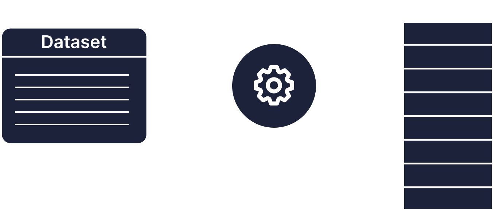

# 7 - Hashing

## Pengertian
Hashing adalah metode atau algoritma yang berfungsi untuk menyimpan dan mengakses data secara efisien. Hashing menyimpan dataset yang besar ke dalam tabel hash yang lebih kecil sehingga dataset tersebut terbagi menjadi bagian yang lebih kecil juga sesuai dengan jumlah baris tabelnya. 

Pembagian dataset tersebut dapat mempercepat proses penyimpanan dan pengaksesan data. Proses pengaksesan dapat dilakukan dengan pencarian *index* pada tabel di mana data tersebut disimpan. *Index* pada konsep Hashing dapat diibaratkan sebagai key yang mengarahkan tempat di mana data tersebut disimpan di dalam tabel hash.

Konsep indexing dan tabel *hash* pada Hashing mirip seperti halnya pada Array. Hal ini menyebabkan rata-rate **kecepatan kompleksitas pada Hashing adalah O(1).**

## Kenapa Pakai Hashing?
- Memiliki rata-rata kecepatan menyimpan dan mengakses data dengan kompleksitas waktu O(1)
- Mampu melakukan insert, remove, dan searching dengan kecepatan rata-rata O(1) juga sehingga lebih baik daripada konsep Struktur
- Data yang lain seperti self-balancing tree dan Linked List
- Mampu membagi dataset yang besar menjadi dataset yang lebih kecil
- Digunakan pada database indexing 
- Digunakan untuk mengamankan data sensitif (enkripsi dan dekripsi)
- Digunakan untuk dictionary

## Komponen Hashing
1. Key -> Mengarahkan index atau lokasi data yang disimpan di dalam hash table 
2. Hash Function → Membuat index dari input data 
3. Hash Table → Tempat di mana data disimpan

## Mekanik Hashing
1. Membuat *hash table* 
2. Menentukan *hash function* 
3. Mencari key untuk data input

## Kapan Tidak Pakai Hashing
1. Membutuhkan sorted data (menggunakan konsep self balancing tree)
2. Membutuhkan prefix searching (menggunakan konsep trie)
   
## Jenis Hashing
### Hash Set 
→ menyimpan data yang unik (tidak boleh ada duplicate)
Penjelasan:
```java
HashMap<K,V> <nama_variabel>
```
   - Dapat menyimpan NULL
   - Tidak boleh ada data duplikat 
   - Tidak thread safe
### Hash Map 
→ menyimpan data berupa pasangan key-value 
Penjelasan
```java
HashSet<E> <nama_variabel>
```
   - Dapat menyimpan satu buah key pada pasangan key-value yang bernilai NULL dan banyak buah value yang bernilai NULL
   - Tidak thread safe
### Hash Table 
→ menyimpan data berupa pasangan key-value
```java
Hashtable<K,V> <nama_variabel>
```
   - Tidak boleh bernilai NULL
   - Thread safe

## Collision Handling
### Chaining
Ketika ditemukan data yang memiliki key yang ber-index sama, maka akan dibuat list yang dimasukan di baris tabel tersebut. List dapat berupa linked list, BST, atau self balancing tree

   1. Kelebihan
      - Simple
      - Tabel tidak pernah kekurangan baris
      - Dapat digunakan untuk menambahkan data yang tidak diketahui jumlahnya

   2. Kekurangan
      - Ada kemungkinan chain berjumlah n sehingga memiliki kompleksitas waktu O(n)
      - Ada kemungkinan terdapat baris tabel yang tidak digunakan
      - Memakan banyak ruang penyimpanan

   3. Implementasi
      - Digunakan pada data yang berubah secara dinamis
      - Jika memerlukan yang simpel, cepat, tetapi tidak memperdulikan ruang penyimpanan

### Linear Addressing
Ketika ditemukan data yang memiliki key yang ber-index sama, maka data akan dioper ke baris berikutnya dan seterusnya
   1. Kelebihan
      - Tabel dapat digunakan secara efektif (tidak ada baris yang kosong)
      - Menggunakan ruang penyimpanan dengan efektif
   2. Kekurangan
      - Ada kemungkinan kekurangan baris pada kolom
   3. Implementasi
      - Digunakan pada data yang tidak terlalu sering berubah
      - Memiliki ruang penyimpanan terbatas

## Tambahan
### Load Factor
Jika jumlah data pada tabel sudah mencapai pada kapasitas tertentu (load factor) maka baris pada tabel akan bertambah