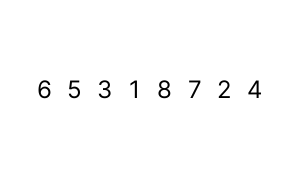

# Bubble Sort

## Konsep
Bubble sort adalah algoritma pengurutan sederhana yang bekerja dengan membandingkan pasangan elemen bersebelahan dalam daftar dan menukar mereka jika urutan mereka salah. Ini berulang kali melintasi data hingga tidak ada lagi pertukaran yang perlu dilakukan, sehingga elemen-elemen terurut secara bertahap naik ke posisi yang tepat. Algoritma ini dinamakan "bubble sort" karena elemen-elemen yang lebih kecil "naik ke permukaan" seperti gelembung air saat diurutkan. Meskipun bubble sort mudah dipahami, namun biasanya kurang efisien untuk daftar yang besar karena kompleksitas waktu yang lebih tinggi daripada algoritma pengurutan lainnya.




[Ilustrasi Bubble Sort](https://visualgo.net/en/sorting)

### Kelebihan
- Implementasi yang sederhana.
- Cocok untuk data yang hampir terurut

### Kekurangan
- Kompleksitas waktu yang buruk "O(n^2)" 
- Penggunaan memori yang tidak efisien
- Jika ada elemen dengan nilai yang sama, posisi dapat berubah setelah dilakukan sorting

### Contoh Penerapan

```java
public class Main {
    static void bubbleSort(int[] arr) {
        int n = arr.length;
        for (int i = 0; i < n - 1; i++) {
            for (int j = 0; j < n - 1 - i; j++) {
                if (arr[j] > arr[j + 1]) {
                    int temp = arr[j];
                    arr[j] = arr[j + 1];
                    arr[j + 1] = temp;
                }
            }
        }
    }

    public static void main(String[] args) {
        int[] array = {4, 2, 3, 1};
        int size = array.length;

        bubbleSort(array);

        System.out.print("Sorted array: ");
        for (int i = 0; i < size; i++) {
            System.out.print(array[i] + " ");
        }
        System.out.println();
    }
}

```

## Tambahan
[Visualisasi Bubble Sort](https://www.hackerearth.com/practice/algorithms/sorting/bubble-sort/visualize/)
